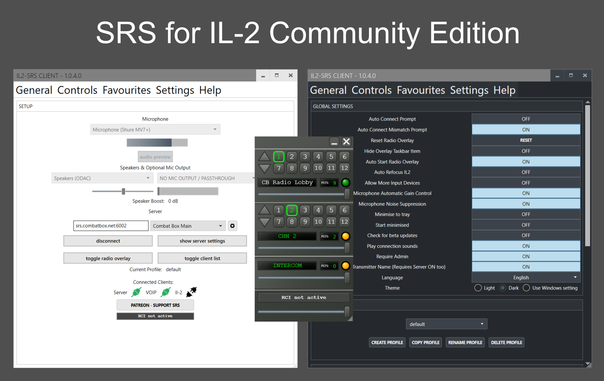

# IL2-SimpleRadio Standalone
An open source Stand alone Radio for IL2

Please obtain the latest release from the Releases page

Donate if you want to so I can purchase Hardware for testing :) 

## Helping with translations

Client translations live in `IL2-SR-Client/Localization/*.resx`. The current non-English text is machine translated, so community corrections are welcome: keep the English `name` keys unchanged and edit the translated `<value>` text. See `IL2-SR-Client/Localization/README.md` for the full workflow.

 

  

 

<a href="https://www.jetbrains.com/?from=DCS-SimpleRadioStandalone" >Proudly supported by JetBrains Open Source
    </a>
