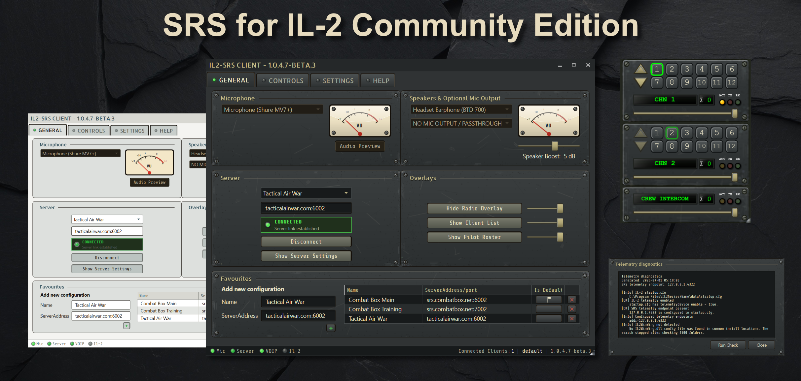

  

## Download

Download the latest stable Community Edition updater: [IL2-SRS-AutoUpdater.exe](https://github.com/riaanjutte/IL2-SimpleRadioStandalone/releases/latest/download/IL2-SRS-AutoUpdater.exe).

## Installation

Install IL2-SRS only once. One installation supports both IL-2 Great Battles and IL-2 Korea.

Use the recommended `C:\Program Files\IL2-SimpleRadio-Standalone` application folder. Do not install SRS inside either game folder. The installer detects both games and configures their telemetry independently.

User settings, profiles, and key bindings are stored in `%AppData%\IL2-SRS`, so they remain available when SRS is updated or moved. The installer can consolidate older duplicate installations and creates a migration backup before retiring their program files.

## IL-2 Korea support

IL2-SRS supports IL-2 Korea alongside IL-2 Great Battles. Please report Korea-specific issues through the Help tab support buttons and include logs where possible.

## Community Edition highlights

1. Localization support for English, German, French, Spanish, Italian, and Russian, with editable `.resx` translation files.
2. Improved joystick reconnect handling so PTT can recover after device disconnect/reconnect.
3. Expanded radio overlay with 12 channel buttons, channel up/down controls, pilot counts, mute support, and RCI status on Combat Box.
4. Pilot Roster window for participating servers showing friendly pilots, callsigns, vehicles, spawn airfields, and tuned radio channels.
5. Community recommended settings prompt for existing users.
6. Dark mode with Windows theme detection.

## What's new in 1.0.4.12

- Assign keys to show or hide the Pilot Roster and Client List. Both windows now keep their position and size when toggled or updated.
- Microphone capture can recover automatically after an audio device reset.
- Updating now removes an obsolete DLL that could make an installed 1.0.4.12 client continue to report 1.0.4.11 and offer the update again.
- Pilot identity is remembered separately for Great Battles and Korea, improving callsign display when switching games. Start SRS before joining a multiplayer server in each game at least once so it can learn that game's pilot name.

See the [full release notes](https://github.com/riaanjutte/IL2-SimpleRadioStandalone/releases/tag/v1.0.4.12).

## Community thanks

Thanks to Broadway for extensive testing, practical feedback, and suggestions that helped shape the Community Edition improvements.

Thanks to Asken for contributing the web server for Docker and Windows services.

## Helping with translations

Client translations live in `IL2-SR-Client/Localization/*.resx`. The current non-English text is machine translated, so community corrections are welcome.

You can help in two ways:

1. Open a GitHub issue using the `Translation correction` template.
2. Edit the relevant `.resx` file and open a pull request.

See `TRANSLATING.md` for the full workflow. Translation pull requests are automatically checked for missing keys, duplicate keys, invalid XML, blank values, and broken placeholders such as `{0}`.

## Pilot Roster server support

Server administrators can add Pilot Roster support by following [Pilot-Roster-Server-Guide.md](Pilot-Roster-Server-Guide.md).

## Hosting a server

There are two ways to run an IL2-SRS server. Current clients connect to either one in the same way, on the same port for TCP and UDP (default `6002`).

- **Windows server window** (`IL2-SR-Server.exe`), included in every release package. See [Server setup](https://srsforil2.com/server-admin/server-setup/).
- **Web server (preview)**, which runs in Docker (Linux or Windows) or as a Windows service, with no desktop session, and is managed from a browser:
  - a dashboard with listener health, clients and recent activity;
  - mute, kick and ban clients, with a reason and optional duration;
  - settings, channel names and bans, applied immediately;
  - an event log of admin actions and client connections;
  - a REST API with read-only and read-write API keys.

  On first start it imports an existing `server.cfg` and `banned.txt`, so settings, channel names and bans carry over. From 1.0.5.0-beta.1, each release provides a self-contained Windows build, `IL2-SRS-Server-Web-<version>-win-x64.zip`, as a separate download that needs no .NET installation. You can also use the [`asken/il2-srs-server:preview`](https://hub.docker.com/r/asken/il2-srs-server) Docker image, or build `IL2-SRS-Server-Web` with the .NET 10 SDK. See [Web server (Docker and Windows service)](https://srsforil2.com/server-admin/web-server/) and [IL2-SRS-Server-Web/README.md](IL2-SRS-Server-Web/README.md).

# IL2-SimpleRadio Standalone
An open source Stand alone Radio for IL2

Please obtain the latest release from the Releases page

Donate to Ciribob (the original developer of SRS) if you want to so that he can purchase Hardware for testing :) 

<a href="https://www.jetbrains.com/?from=DCS-SimpleRadioStandalone" >Proudly supported by JetBrains Open Source
    </a>
